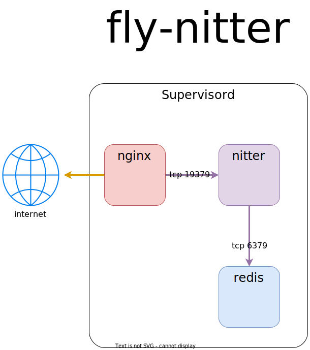

# fly-nitter
## Nitter in a box!
Run the great [Nitter project](https://github.com/zedeus/nitter) batteries included!
All in one Fly MicroVM. Nitter, Redis, and Nginx are run to provide the
stack required to use Nitter all in one Docker image. I wouldn't recommend
running this on Docker itself.

## Architecture


## nitter.conf example

This file should be placed in [.nitter](./nitter/)

```ini
[Server]
address = "127.0.0.1"
port = 19379
https = false
httpMaxConnections = 100
staticDir = "./public"
title = "<your-title>"
hostname = "<your-hostname>"

[Cache]
listMinutes = 240  
rssMinutes = 10 
redisHost = "localhost"  
redisPort = 6379
redisConnections = 20  
redisMaxConnections = 30

[Config]
base64Media = true  
enableRSS = true  
enableDebug = true  
proxy = ""  
proxyAuth = ""
tokenCount = 10

[Preferences]
theme = "Nitter"
replaceTwitter = "<your-hostname>"
replaceYouTube = "piped.kavin.rocks"
replaceReddit = "teddit.net"
replaceInstagram = ""
proxyVideos = true
hlsPlayback = true
infiniteScroll = true
```


